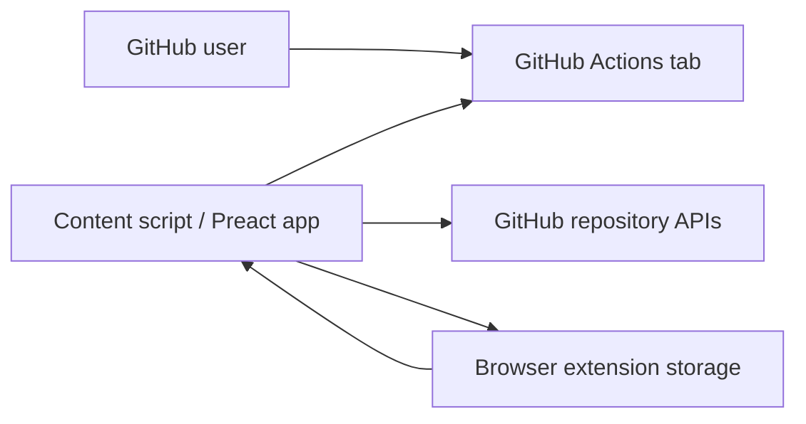

# Architecture

このドキュメントは github-actions-search のシステム全体像をまとめる。細かい実装規約は `.agents/skills/coding-guideline/SKILL.md` を参照する。

## 全体像

このプロジェクトは Chrome extension だ。`manifest.json` と `vite-plugin-web-extension` により、`src/content/index.ts` が GitHub の Actions 画面に content script として読み込まれる。

## 主要責務

- `src/content/index.ts`: content script の entrypoint。対象ページでアプリ初期化を開始する。
- `src/content/initialize-app.tsx`: GitHub 画面上への mount point 作成と Preact app の初期化を担当する。
- `src/content/App.tsx`: Actions sidebar に追加する検索・pin UI の composition root。
- `src/content/hooks/`: workflow file の取得、default branch 解決、pin 状態管理などの UI-facing state を扱う。
- `src/content/repository/`: GitHub から workflow / branch 情報を取得する境界層。
- `src/content/util/local-storage.tsx`: extension storage による pin 永続化の境界層。
- `src/components/ui/`: shadcn-ui 由来の小さな Preact UI component。
- `test/`: built extension を Chromium に読み込んで確認する Playwright VRT。

## Data Flow

1. ユーザーが GitHub repository の Actions tab を開く。
2. Content script が対象 URL / DOM を検出し、Actions sidebar に検索 UI を mount する。
3. Repository boundary が default branch と `.github/workflows/` 配下の workflow file を取得する。
4. Hook 層が workflow 一覧、検索語、pin 状態を UI 用 state に写像する。
5. Pin 操作は browser extension storage に保存され、次回表示時に復元される。

## 品質戦略

このプロジェクトの中核戦略は、型検査・境界層の分離・軽量な unit test・実ブラウザ VRT を組み合わせて信頼性を上げることだ。

- GitHub API response や extension storage などの外部データは schema validation で検証する。
- UI state と repository/storage boundary を分離し、hook と pure utility を Vitest で高速に検証する。
- content script と extension としての統合挙動は Playwright VRT で確認する。
- TypeScript / oxlint / oxfmt / cspell / Vitest / build を品質ゲートとして扱い、エラー回避のために設定を弱めない。
